<!-- _class: lead -->

# Progetto di Ingegneria del Software Avanzata

## E-commerce full-stack, testato e riproducibile

Ingegneria del Software Avanzata · A.A. 2025/2026

---

# Obiettivo del progetto

Realizzare un e-commerce a singolo venditore che copra l'intero ciclo di acquisto:

- consultazione del catalogo;
- account e autenticazione;
- carrello persistente e checkout;
- storico ordini;
- amministrazione protetta.

**Obiettivo ingegneristico:** rendere il progetto tracciabile, verificabile e riproducibile.

<!--
Messaggio: non è una semplice vetrina; include logica di business e processo di consegna.
-->

---

# Attori e complessità

| Attore | Responsabilità |
| --- | --- |
| Ospite | Catalogo, filtri, registrazione |
| Cliente | Login, carrello, checkout, storico |
| Amministratore | Prodotti, utenti, ordini e stati |

Complessità principali:

- SPA Angular separata dall'API Rails;
- JWT e autorizzazione basata sui ruoli;
- checkout transazionale con decremento e rollback dello stock;
- gestione controllata degli stati dell'ordine.

---

# Architettura



- Frontend: Angular.
- Backend: Ruby on Rails API-only.
- Persistenza: SQLite.
- Distribuzione: Nginx + Rails con Docker Compose.

---

# Repository master e submodule

```text
master repository
├── frontend/       Angular (submodule)
├── backend/        Rails (submodule)
├── docs/           specifica, evidenze, presentazione
├── compose.yaml    stack completo
└── .github/        Master CI
```

Principio adottato:

- codice e test restano nel rispettivo submodule;
- documentazione, Compose e CI trasversale vivono nel master;
- un clone con `--recurse-submodules` ricostruisce la revisione esatta.

---

# Requisiti funzionali

| ID | Capacità |
| --- | --- |
| FR-01 | Registrazione e login |
| FR-02 | Catalogo, ricerca e filtri |
| FR-03 | Gestione del carrello |
| FR-04 | Checkout atomico e controllo stock |
| FR-05 | Storico e dettaglio ordini |
| FR-06 | Operazioni amministrative |

Ogni requisito ha criteri di accettazione e collegamenti a implementazione, test e job CI.

---

# Esempio di tracciabilità: checkout

**FR-04 — Checkout**

| Elemento | Evidenza |
| --- | --- |
| Implementazione | `Orders::Create`, `order_controller.rb`, `checkout-service.ts` |
| Regola | l'ordine viene creato solo se lo stock è disponibile; il carrello viene svuotato |
| Fallimento | stock esaurito → nessun ordine parziale, stock invariato |
| Test | integrazione API + `orders/create_test.rb` |
| CI | job Backend quality and coverage |

---

# Strategia di test

**Backend Rails**

- modelli: validazioni e transizioni di stato;
- servizi: carrello, checkout, rollback e stock;
- integrazione: contratti API, autorizzazione e flussi completi.

**Frontend Angular**

- servizi HTTP e stato del carrello;
- guard di autenticazione/amministrazione;
- interceptor JWT;
- componente rappresentativo per il filtro prezzo.

---

# Copertura misurata

| Area | Test | Linee | Branch | Soglia |
| --- | ---: | ---: | ---: | --- |
| Backend | 20 run, 69 assertion | 80,26% | 53,07% | 75% / 45% |
| Frontend | 7 file, 13 test | 43,61% | 65,00% | 40% / 60% |

- SimpleCov genera report HTML e machine-readable per Rails.
- Vitest genera HTML, JSON e LCOV per Angular.
- Le soglie sono applicate localmente e in CI.

<!--
Mostrare, se richiesto, docs/evidence.md o gli artefatti della pipeline.
-->

---

# Continuous Integration

La **Master CI** viene eseguita su push e pull request del repository master.

| Job | Controlli |
| --- | --- |
| Backend | database, RuboCop, Brakeman, Bundler Audit, test, coverage |
| Frontend | npm ci, type-check, test/coverage, build |
| Container | `docker compose config` e build delle immagini |

Evidenza: [run 29488855352 — success](https://github.com/LucaPrevi0o/Prog_IngSW_Avanzata/actions/runs/29488855352).

---

# Distribuzione containerizzata



```bash
cp .env.example .env
docker compose up --build
```

- Dockerfile Rails orientato alla produzione;
- build Angular multi-stage servita da Nginx;
- health check backend e volume `backend_storage`;
- proxy same-origin per le route `/api`.

---

# Riproducibilità verificata

Da un clone indipendente:

```bash
git clone --recurse-submodules <repository>
cd <repository>
cp .env.example .env
make setup
make coverage-backend
make coverage-frontend
docker compose up --build
```

Esito:

- submodule recuperati ai commit fissati;
- setup, test e coverage riusciti;
- stack Compose avviato e health check/proxy verificati.

---

# Demo finale

1. Avviare lo stack: `docker compose up --build`.
2. Aprire `http://localhost:8080`.
3. Registrare un cliente.
4. Filtrare il catalogo e aggiungere un prodotto al carrello.
5. Eseguire il checkout.
6. Aprire lo storico ordini.
7. Mostrare la Master CI verde e le evidenze di coverage.