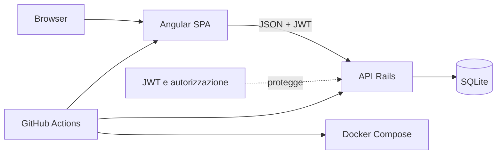

# Shop — specifica di progetto

## Ambito e attori

Shop è un'applicazione e-commerce a singolo venditore. Il suo ambito comprende scoperta dei prodotti, accesso all'account, carrello persistente, checkout, consultazione degli ordini e amministrazione protetta. Gli attori sono:

- **Ospite**: consulta il catalogo e crea un account.
- **Cliente**: si autentica, gestisce carrello/profilo, effettua ordini e visualizza esclusivamente il proprio storico.
- **Amministratore**: gestisce i prodotti e consulta/gestisce utenti e ordini.

Il client è una single-page application Angular; l'API JSON è realizzata in Ruby on Rails e persiste i dati in SQLite.

## Requisiti funzionali e tracciabilità

| ID | Requisito | Criteri di accettazione | Implementazione | Evidenza di test automatizzata | Job CI |
| --- | --- | --- | --- | --- | --- |
| FR-01 | Registrazione e login | La registrazione con email/password valide crea un cliente e un token; dati mancanti e email duplicata sono rifiutati; un login non valido restituisce 401. | `backend/app/controllers/user_controller.rb`, `auth_controller.rb`; `frontend/src/app/services/user-service.ts` | `backend/test/integration/api_contract_flow_test.rb` (autenticazione); `frontend/src/app/services/user-service.spec.ts` | Backend, Frontend |
| FR-02 | Consultazione e filtro del catalogo | Un ospite può elencare e paginare i prodotti, filtrandoli per nome, categoria e prezzo. | `product_controller.rb`, `Product.apply_filters`; `product-service.ts` | `backend/test/controllers/product_controller_test.rb`; `frontend/src/app/services/product-service.spec.ts` | Backend, Frontend |
| FR-03 | Gestione del carrello | Un cliente autenticato può aggiungere, aggiornare, rimuovere e svuotare il proprio carrello; prodotti inesistenti e quantità non valide falliscono senza corromperlo. | `Carts::*`, `cart_controller.rb`; `cart-service.ts` | `backend/test/integration/api_contract_flow_test.rb` (ciclo di vita del carrello); `frontend/src/app/services/cart-service.spec.ts` | Backend, Frontend |
| FR-04 | Checkout | Un checkout valido crea un ordine e le sue righe, registra snapshot di prezzi/pagamento, decrementa atomicamente lo stock e svuota il carrello. Input non valido o stock esaurito viene rifiutato senza creare un ordine parziale. | `backend/app/services/orders/create.rb`, `order_controller.rb`; `frontend/src/app/services/checkout-service.ts` | `backend/test/integration/api_contract_flow_test.rb` (checkout); `backend/test/services/orders/create_test.rb` (stock esaurito e rollback) | Backend |
| FR-05 | Storico degli ordini | Un cliente può elencare/filtrare i propri ordini e visualizzarne il dettaglio; un altro cliente non può recuperarli. | `order_controller.rb`; componenti `orders` e `order-details` | `backend/test/integration/api_contract_flow_test.rb` (filtri); `backend/test/integration/authorization_test.rb`; `frontend/src/app/guards/auth-guard.spec.ts` | Backend, Frontend |
| FR-06 | Amministrazione | Solo gli amministratori possono gestire i prodotti e consultare utenti/ordini. Gli stati sono validati; l'annullamento di un ordine ripristina una sola volta lo stock. | `backend/app/controllers/admin/*`, `Order`; `frontend/src/app/admin/*` | `backend/test/integration/api_contract_flow_test.rb` (stato/annullamento); `backend/test/models/order_test.rb`; `frontend/src/app/admin/admin-guard.spec.ts` | Backend, Frontend |

## Requisiti non funzionali

| ID | Requisito | Criteri di accettazione | Implementazione | Evidenza di test/verifica | Job CI |
| --- | --- | --- | --- | --- | --- |
| NFR-01 | Sicurezza | Le route protette richiedono un JWT valido (401); le route amministrative il ruolo `ADMIN` (403). Gli hash delle password non sono mai serializzati. | `backend/app/controllers/application_controller.rb`, `backend/app/services/auth/token.rb`, controller `admin/*` | `backend/test/integration/authorization_test.rb`; `backend/test/integration/api_contract_flow_test.rb` | Backend |
| NFR-02 | Configurazione | `.env.example` documenta `FRONTEND_ORIGIN` e `API_BASE_URL`; `make dev` applica entrambi in modo coerente. | `.env.example`, `Makefile`, `frontend/scripts/write-runtime-config.mjs`, `backend/config/initializers/cors.rb` | Verifica manuale documentata in `README.md` tramite `make dev`; `docker compose config --quiet` | Container |
| NFR-03 | Riproducibilità | Un clone pulito con `--recurse-submodules`, `.env`, `make setup` e `make dev` avvia lo stack locale. | `.gitmodules`, `README.md`, `Makefile`, lockfile di entrambi i sottomoduli | Checkout ricorsivo della Master CI; procedura di clone descritta in `README.md` | Backend, Frontend, Container |
| NFR-04 | Evidenza di qualità | Test backend e frontend, report di copertura, artefatti di build e risultati CI sono conservati come evidenza della consegna. Il backend applica inizialmente soglie SimpleCov del 75% sulle linee e del 45% sui branch; il frontend applica soglie Vitest del 40% sulle linee e del 60% sui branch. | `backend/test/test_helper.rb`, `frontend/scripts/check-coverage.mjs`, `.github/workflows/master-ci.yml` | `COVERAGE=true bundle exec rails test`; `npm run test:ci`; artefatti `backend-coverage` e `frontend-evidence` | Backend, Frontend |
| NFR-05 | Distribuibilità | Lo stack è containerizzato con un'immagine Angular/Nginx multi-stage e un'immagine Rails e può essere avviato con `docker compose up --build`. Nginx inoltra `/api` a Rails e il volume `backend_storage` conserva SQLite. | `backend/Dockerfile`, `frontend/Dockerfile`, `frontend/nginx.conf`, `compose.yaml` | `docker compose config --quiet`; verifica del flusso principale descritta in `README.md` | Container |

## Assunzioni ed esclusioni

I prezzi dei prodotti sono valori numerici assimilabili a EUR e lo stock è gestito dall'applicazione. I dati di pagamento costituiscono uno snapshot del checkout: non viene chiamato alcun gateway di pagamento esterno. L'applicazione non include gestione multi-venditore, integrazione con corrieri, rimborsi, recupero password, notifiche email o gestione di segreti di produzione. Docker Compose costituisce l'evidenza di deployment, salvo la configurazione di un autentico target Kamal.

## Panoramica di architettura, dati e API



Le risorse dati centrali sono `users`, `products`, `carts`/`cart_items`, `orders`/`order_items` e gli snapshot di profilo/pagamento. Le route API pubbliche coprono registrazione, login e lettura del catalogo. Il JWT protegge gli endpoint di profilo, carrello e ordini; `/admin/*` richiede inoltre il ruolo di amministratore. L'API serializza JSON con contratti camelCase utilizzati da Angular.

## Sintesi dei casi d'uso

| Caso d'uso | Attore principale | Flusso principale di successo |
| --- | --- | --- |
| UC-01 Registrazione / login | Ospite / Cliente | Invia le credenziali, riceve il JWT e accede all'area autenticata. |
| UC-02 Consultazione catalogo | Ospite | Cerca/filtra i prodotti, ne seleziona uno e ne consulta il dettaglio. |
| UC-03 Gestione carrello | Cliente | Aggiunge un prodotto disponibile, modifica la quantità, rimuove articoli e controlla il totale. |
| UC-04 Checkout | Cliente | Invia dati di consegna/pagamento, verifica lo stock, crea l'ordine e svuota il carrello. |
| UC-05 Visualizzazione storico | Cliente | Elenca/filtra i propri ordini e ne apre il dettaglio. |
| UC-06 Amministrazione negozio | Amministratore | Gestisce prodotti, consulta utenti/ordini e aggiorna uno stato ammesso dell'ordine. |

## Evidenze della consegna e struttura della relazione

Conservare i report di copertura HTML/leggibili dalla macchina, una run CI root riuscita e una cattura del terminale che mostri l'avvio dello stack containerizzato e il funzionamento del flusso principale. Il workflow root `Master CI` produce gli artefatti `backend-coverage` e `frontend-evidence`: la [run 29488855352](https://github.com/LucaPrevi0o/Prog_IngSW_Avanzata/actions/runs/29488855352) è l'evidenza verde di riferimento sul commit master corrente. I risultati misurati e la procedura di raccolta sono riportati in [evidence.md](evidence.md); una scaletta pronta per relazione o slide è in [presentation.md](presentation.md). Presentare il lavoro nel seguente ordine:

1. Complessità del progetto e attori.
2. Architettura, modello dati e confini API.
3. Requisiti e tabella di tracciabilità precedente.
4. Strategia di test, casi di fallimento e copertura.
5. Pipeline CI/CD e artefatti.
6. Deployment containerizzato e procedura di clone riproducibile.

Per la consegna, effettuare prima il push dei commit dentro `backend/` e `frontend`, quindi registrare nel repository master i puntatori aggiornati dei sottomoduli. Un revisore può riprodurre l'esatta revisione con:

```bash
git clone --recurse-submodules <master-repository-url>
cd <master-repository-directory>
cp .env.example .env
make setup
make dev
```
